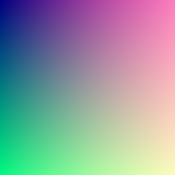

# SimplePNG

A zero-dependency minimalist Java library for creating PNG files.

It is implemented in pure Java and independent of Java AWT (ImageIO).
It can be easily used with Android or JavaFX.

## Feature

* Support for Java 8+;
* No dependence, only needs the `java.base` module;
* Very small (< 20 KiB);
* Supports writing compressed or uncompressed PNG images;
* Support for optional alpha channels;
* Support writing PNG metadata.

## Limitations 

* Currently only true color images are supported, support for grayscale images is planned;
* Currently only 8bpc images are supported;
* PNG filter is not supported, it may be supported in the future;
* Color palette is not supported.

## Adding SimplePNG to your build

Maven:
```xml
<dependency>
  <groupId>org.glavo.kala</groupId>
  <artifactId>simple-png</artifactId>
  <version>0.1.0</version>
</dependency>
```

Gradle:
```kotlin
implementation("org.glavo.kala:simple-png:0.1.0")
```

## Usage

The core abstraction of SimplePNG represents the [`ArgbImage`](src/main/java/org/glavo/png/image/ArgbImage.java) interface 
of true color images and the [`PNGWriter`](src/main/java/org/glavo/png/PNGWriter.java) used to write images to the output stream.

This is a simple example:

```java
int rgba(int r,int g,int b,int a) { return ((r << 16) | ((g) << 8) | ((b)) | ((a) << 24)); }

ArgbImage image = new ArgbImage() {
    public int getWidth() { return 250; }
    public int getHeight() { return 250; }
    public int getArgb(int x, int y) { return rgba(x & 255, y & 255, 128, (255 - ((x / 2) & 255))); }
}

try (PNGWriter writer = new PNGWriter(Files.newOutputStream(Paths.get("gradient.png")))) {
    writer.write(image);
}
```

Result:



In addition to directly implementing the `ArgbImage` interface, 
SimplePNG also has some `ArgbImage` built-in implementations to facilitate you to interact with Java AWT/JavaFX or draw pictures.

```java
// Array-based writable image
ArgbImageBuffer buffer = new ArgbImageBuffer();
for (int x = 0; x < 250; x++) {
    for (int y = 0; y < 250; y++) {
        buffer.setArgb(x, y, (255 - ((x / 2) & 255)), x & 255, y & 255, 128);
    }
}

// Wrapper for java.awt.image.BufferedImage
ArgbImage awtImage = new AWTArgbImageWrapper(ImageIO.read("image.jpg"));

// Wrapper for javafx.scene.image.Image
ArgbImage fxImage = new JavaFXArgbImageWrapper(new Image("image.jpg"));
```

### `PNGWriter`

PNGWriter provides a set of configurable options.

By default, `PNGWriter` will write files using 32-bit color (8 bits per channel, with an alpha channel).
You can remove the alpha channel by setting the type to RGB.

```java
new PNGWriter(outputStream, PNGType.RGB)
```

By default, `PNGWriter` will compress images using the default compression level.
You can modify the compression level of `PNGWriter`.

```java
new PNGWriter(outputStream, 0)
```

The lowest compression level is `0`, which means no compression;
compression levels up to `9`, take more time to compress but have the smallest end result.

### Metadata

SimplePNG supports attaching metadata to PNG images.

```java
ArgbImage image = ...;

PNGMetadata metadta = new PNGMetadata()
        .setAuthor("Glavo")
        .setComment("SimplePNG example image");

ArgbImage imageWithMetadata = image.withMetadata(metadata);

try (PNGWriter writer = ...) {
    writer.write(imageWithMetadata);
}
```

SimplePNG will write the metadata into PNG files.

## Donate

If you like this library, donating to me is my greatest support!

Due to payment method restrictions, donations are currently only supported through payment channels in Chinese mainland (微信，支付宝，爱发电等).

Here are the ways to donate: [捐赠支持 Glavo](https://donate.glavo.site/)
